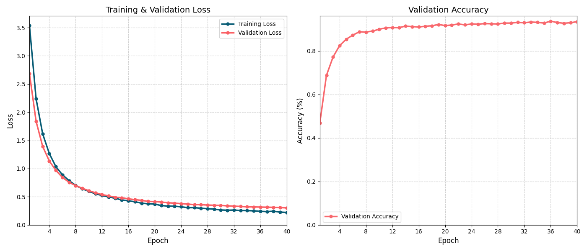
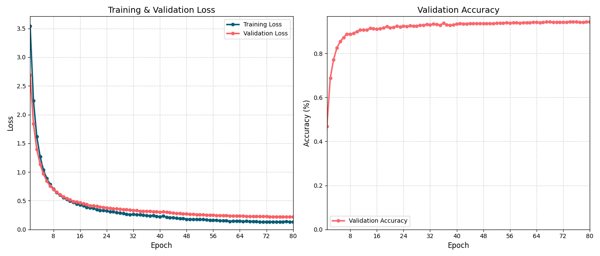
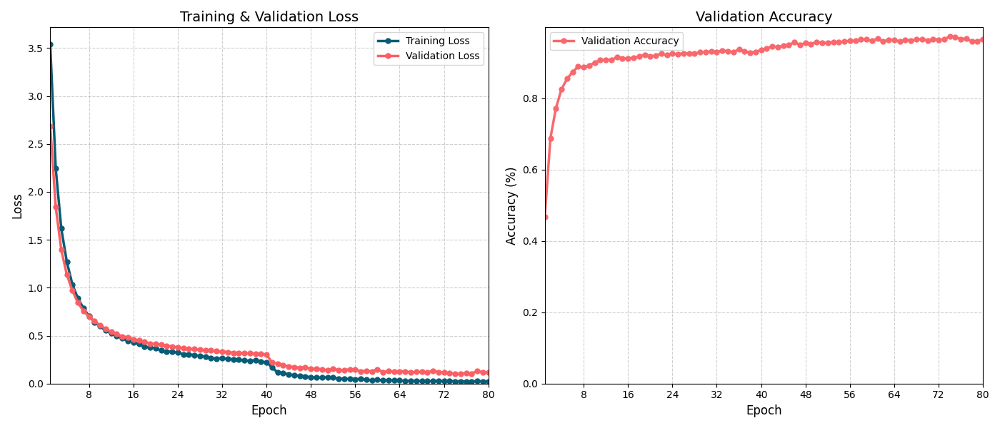
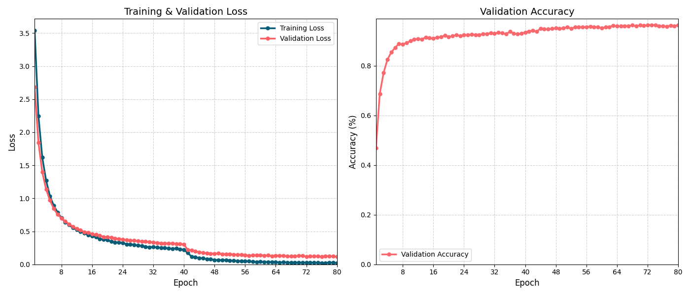

# Stage 2 — Transfer Learning

## Goal

Stage 1 established a working CNN pipeline on the Oxford 102 Flowers dataset, but the custom SimpleCNN reached only ~42% top-1 accuracy — well below the
SOTA benchmark of 99.85% (Efficient Adaptive Ensembling) and even the EfficientNet-B0 paper result of 97.3%[[1]](#references) .

The accuracy gap points to a fundamental limitation: training a shallow CNN from scratch on a small dataset (8,189 images, 102 classes) cannot match
the rich feature representations learned from large-scale pre-training.

This stage applies **transfer learning** — leveraging an ImageNet pre-trained EfficientNet-B0 backbone.

## What This Stage Covers

- Classifier head fine-tuning
- Last layer + classifier head fine-tuning
- Last three layers + classifier head fine-tuning

## File Structure
```
📁 02_transfer_learning/
├── 📁 checkpoints/ # this folder contains the artifacts from running python codes
├── 📁 model/  # training loop and fine tuning definition
├── 📁 plot_results/ # figures related to accuracy and loss for each run
├── 📁 postprocess/ # plot figures tools
├── 📁 preprocess/ # data manipulate tools
├── README.md # detailed procedures for pretrained model, unfreeze proccess, training and key findings
├── classifier_head.py # only modified the head of EfficientNet-B0 model, let it fit flower category inference
├── transfer_learning_last_layer.py # unfreeze last layer + head. 
├── transfer_learning_last_layer_Scheduler.py # unfreeze last layer + head, schedule the lr during training
├── transfer_learning_last_3layer.py # unfreeze last three layers + head
├── transfer_learning_last_3layer_Scheduler.py # unfreeze last three layers + head, schedule the lr during training
└── transfer_learning_last_3layer_difflr.py # unfreeze last three layers + head, different block uses different lr during training
Notes: please pay attention to the difference for each strategy in terms of lr, momentum
```

## Key Design Decisions

**1. Why EfficientNet-B0 **  
EfficientNet-B0 (5.3M parameters) is the baseline of the EfficientNet family. For a 102-class fine-grained
classification task on a small dataset (8,189 images), B0 offers a strong accuracy and efficiency trade-off.
Given limited compute resources, a small backbone like EfficientNet‑B0 makes fast experimentation and iteration possible.

**2. Why classifier head -> last layer -> last three layers fine-tuning**  
To better understanding the magic of fine-tuning art and the performance of CNN backbone, gradual unfreezing offers good oppotunities. Comparison among classifier head, last layer and last three layers unfreezing will show the contribution of each part of the CNN backbone and inference accuracy changing. Last, with gradual unfreezing strategy, the model training process will be under control. If go to last three layers + head fine-tuning directly, some avoid catastrophic forgetting occurs easily and the reasons are hard to seize. By unfreezing one stage at a time, the training process remains interpretable and any performance degradation can be traced back to a specific change.

## Results
**1. Classifier head fine-tuning**  
**Code:** classifier_head.py  
**Artifact:** ./checkpoints/efficientnet_b0_flower.pth  
| Metric | Value |
|--------|-------|
| Dataset | Oxford 102 Flowers |
| Top-1 Accuracy | 93.49% (best:93.73%) |
| Epochs | 40 |
| Optimizer | SGD, lr=0.1, weight_decay=1e-4 |

Notes: Two types of accuracy are provided, one is accuracy after final epoch and another is best during training. Same for other tables

As shown in the table and figure above, fine-tuning only the classifier head of the EfficientNet-B0 model for 10 epochs improves Top-1 accuracy from ~42%
to ~90%. This result demonstrates that the pretrained backbone already encodes strong, transferable visual features — training the classifier head alone is
sufficient to unlock most of its representational capacity for this task. It is highly expected that what can be achieved, when more blocks of backbone are unfrozen.

**2. Last layer + classifier head fine-tuning**  
Note that this step does not start from the original EfficientNet‑B0 weights.
It continues training from the model obtained in the “classifier head fine‑tuning” stage, and then additionally unfreezes the
last layer of the backbone.  
**2.1**  
**Code:** transfer_learning_last_layer.py  
**Artifact:** ./checkpoints/efficientnet_b0_flower_lastlayer_plus_head.pth  
| Metric | Value |
|--------|-------|
| Dataset | Oxford 102 Flowers |
| Top-1 Accuracy | 94.30% (best:94.46%) |
| Epochs | 40 |
| Optimizer | SGD, lr=1e-3, momentum=0.9, weight_decay=1e-4 |

 
Unfreezing the last block of the backbone increases the number of trainable parameters from 130,662 to 542,822 (out of 4,138,210 total). However, this
yields only a marginal accuracy gain of 0.83%. Several adjustments could be made to improve performance at this stage. Tried schedule in below section. 

**2.2**  
**Code:** transfer_learning_last_layer_Scheduler.py  
**Artifact:** ./checkpoints/efficientnet_b0_flower_lastlayer_plus_head_Scheduler.pth  
| Metric | Value |
|--------|-------|
| Dataset | Oxford 102 Flowers |
| Top-1 Accuracy | 94.14% (best:94.14%) |
| Epochs | 40 |
| Optimizer | SGD, lr=1e-3, momentum=0.9, weight_decay=1e-4，CosineAnnealingLR|


Applying a CosineAnnealingLR scheduler resulted in a 0.32% accuracy drop, which is counterintuitive given that learning rate scheduling is widely
reported to improve fine-tuning performance in the literature. 

**3. Last 3 layers + classifier head fine-tuning**  
Note that this step does not start from the original EfficientNet‑B0 weights.
It continues training from the model obtained in the “classifier head fine‑tuning” stage, and then additionally unfreezes the
last 3 layers of the backbone.  
**3.1**  
**Code:** transfer_learning_last_3layer.py  
**Artifact:** ./checkpoints/efficientnet_b0_flower_last3layer_plus_head.pth  
| Metric | Value |
|--------|-------|
| Dataset | Oxford 102 Flowers |
| Top-1 Accuracy | 96.58% (best:97.31%) |
| Epochs | 40 |
| Optimizer | SGD, lr=1e-3, momentum=0.9, weight_decay=1e-4 |

  
Unfreezing the last 3 blocks of the backbone increases the trainable parameters from 542,822 to 3,286,402 (out of 4,138,210 total — 79.4% of the model is now
trainable). Despite this substantial increase in trainable capacity, the accuracy gain remains modest at 3.17%, suggesting diminishing returns from unfreezing
deeper layers on this dataset. The following section explores whether a learning rate schedule can further improve performance.

**3.2**  
**Code:** transfer_learning_last_3layer_Scheduler.py   
**Artifact:** ./checkpoints/efficientnet_b0_flower_last3layer_plus_head_Scheduler.pth  
| Metric | Value |
|--------|-------|
| Dataset | Oxford 102 Flowers |
| Top-1 Accuracy | 96.58% (best:96.74%) |
| Epochs | 40 |
| Optimizer | SGD, lr=1e-3, momentum=0.9, weight_decay=1e-4，CosineAnnealingLR|


**3.3**  
**Code:** transfer_learning_last_3layer_difflr.py  
**Artifact:** ./checkpoints/efficientnet_b0_flower_last3layer_plus_head_difflr.pth
| Metric | Value |
|--------|-------|
| Dataset | Oxford 102 Flowers |
| Top-1 Accuracy | 96.42% (best:96.42%) |
| Epochs | 40 |
| Optimizer | SGD, momentum = 0.9 weight_decay=1e-4 |
| lr | 1e-4, 5e-4, 1e-3, 1e-2 for last three blocks and head|



The lack of improvement from the learning rate schedule is counterintuitive, given that adaptive LR strategies are widely reported to benefit fine-tuning.
The underlying reasons warrant further investigation, but are left for future work.

The BiT paper[[2]](#references) shows that fine-tuning will benefits without the weight decays, using group normalization and weight standard, instead of using BN. Worth trying later

## Key Finding
**1. Classifier head fine-tuning**  
With only 10 epoches, inference accuracy reach around 90%, which is a hugh improvement, compared with model trained at **Stage 1**. This shows that the shallow layers and backbone, which have already been trained on large‑scale data, provide generic features that capture common visual characteristics of objects. Large learning rate should be used for this stage, since the weights for head are randomly initialized and large lr will help them converge quickly.

**2.Unfreezing blocks of backbone + classifier head fine-tuning**  
Progressively unfreezing deeper backbone blocks consistently improves accuracy,
but with diminishing returns at each stage:

| Stage | Trainable Params | Top-1 Accuracy (best) | Gain over previous |
|-------|-----------------|----------------------|-------------------|
| Classifier head only | 130,662 | 93.73% | — |
| + Last 1 block | 542,822 | 94.46% | +0.73% |
| + Last 3 blocks | 3,286,402 | 97.31% | +2.85% |

Unfreezing the last 3 blocks yields the most significant jump (+2.85%),
bringing the model to 97.31%. This confirms that deeper backbone
layers encode more task-specific features for fine-grained flower classification.

However, neither CosineAnnealingLR nor discriminative learning rates
(1e-4 → 5e-4 → 1e-3 → 1e-2 across blocks) produced further gains.
All three variants of the last-3-blocks stage converge to approximately
the same accuracy (~96.4–97.3%), suggesting the performance ceiling
for this fine-tuning strategy has been reached at this dataset scale.
## Questions  
During model training, there are many practical questions and “to‑dos” that
easily become overwhelming: how to fully utilize limited compute, how to
increase training efficiency, how to log metrics and artifacts without
producing an unmanageable number of files, and how to inspect the training
process in enough detail to decide when to stop or adjust hyperparameters.
Ideally, we want tools and workflows that save time, compute, and personal
energy: everyone wants the best possible model with minimal training time,
reasonable hardware cost, simple algorithms, and as little manual intervention
as possible. Stage 3 is designed to address exactly these concerns by
introducing more systematic experiment tracking and workflow tooling.
## Reference
- Wizwand, [Oxford Flowers-102 Classification Leaderboard](https://www.wizwand.com/sota/image-classification-on-oxford-flowers-102-test), accessed April 2026.
- Kolesnikov et al., [Big Transfer (BiT): General Visual Representation Learning](https://arxiv.org/abs/1912.11370), ECCV 2020. 
- Nilsback & Zisserman, [Automated Flower Classification over a Large Number of Classes](https://www.robots.ox.ac.uk/~vgg/publications/2008/Nilsback08/), ICCVGIP 2008.
