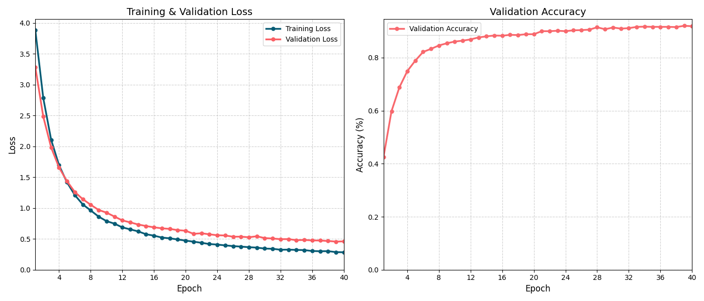
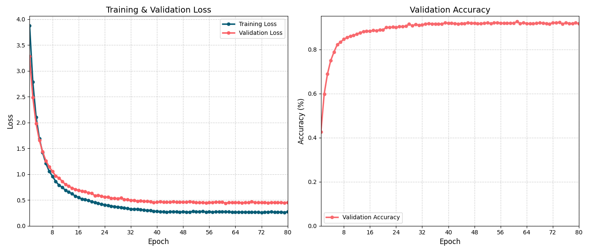

# Stage 2 — Transfer Learning

## Goal

Stage 1 established a working CNN pipeline on the Oxford 102 Flowers dataset,
but the custom SimpleCNN reached only ~42% top-1 accuracy — well below the
SOTA benchmark of 99.85% (Efficient Adaptive Ensembling) and even the
EfficientNet-B0 paper result of 97.3%.

The accuracy gap points to a fundamental limitation: training a shallow CNN
from scratch on a small dataset (8,189 images, 102 classes) cannot match
the rich feature representations learned from large-scale pre-training.

This stage applies **transfer learning** — leveraging an ImageNet pre-trained
EfficientNet-B0 backbone — to close this gap while keeping the model
lightweight enough for futher CNN learning.

## What This Stage Covers

- Classifier header fine-tuning
- Last layer + classifier head fine-tuning
- Last three layer + classifier head fine-tuning

## File Structure
```
📁 01_custom_cnn/
├── main.py # Full pipeline: data loading → pretrained model load and modified → training → visualization
├── 📁 model/ # training loop definition
├── 📁 postprocess/ # plot figures tools
├── 📁 preprocess/ # data manipulate tools
├── README.md # detailed procedures for pretrained model, unfreeze proccess, training and key findings
└── result.png # loss and accuracy plots
```

## Key Design Decisions

**1. Why EfficientNet-B0 **  
EfficientNet-B0 (5.3M parameters) is the baseline of the EfficientNet family. For a 102-class fine-grained
classification task on a small dataset (8,189 images), B0 offers a strong accuracy and efficiency trade-off.
Given limited compute resources, a small backbone like EfficientNet‑B0 makes fast experimentation and iteration possible.

**2. Why classifier head -> last layer -> last three layers fine-tuning**  
To better understanding the magic of fine-tuning art and the performance of CNN backbone, gradual unfreezing benefits. Besides, comparison among classifier head, last layer and last three layers unfreezing will show inference accuracy improving gradually. Last, with gradual unfreezing strategy, the model training process will be under control.

## Results
**1. Classifier head fine-tuning**  
| Metric | Value |
|--------|-------|
| Dataset | Oxford 102 Flowers |
| Top-1 Accuracy | 92.02% |
| Epochs | 40 |
| Optimizer | SGD, lr=0.1, weight_decay=1e-4 |



**2. Last layer + classifier head fine-tuning**  
Note that this step does not start from the original EfficientNet‑B0 checkpoint with only the classifier head and the last layer unfrozen.
Instead, it continues training from the model obtained in the “classifier head fine‑tuning” stage, and then additionally unfreezes the
last layer of the backbone.
| Metric | Value |
|--------|-------|
| Dataset | Oxford 102 Flowers |
| Top-1 Accuracy | 92.59% |
| Epochs | 40 |
| Optimizer | SGD, lr=0.1, weight_decay=1e-4 |



Tried to use batch normalization, CosineAnnealingLR scheduler, but the accuracy doesnot improve
| Metric | Value |
|--------|-------|
| Dataset | Oxford 102 Flowers |
| Top-1 Accuracy | 92.59% |
| Epochs | 40 |
| Optimizer | SGD, lr=0.01, CosineAnnealingLR,momentum = 0.9 weight_decay=1e-4 |


The BiT paper[[1]](#references) shows that fine-tuning will benefits without the weight decays, using group normalization and weight standard, instead of using BN. 

## Key Finding
**1. Classifier head fine-tuning**  
With only 20 epoches, inference accuracy reach around 90%, which is a hugh improvement, compared with model trained at **Stage 1**. This shows that the shallow layers and backbone, which have already been trained on large‑scale data, provide generic features that capture common visual characteristics of objects. Large learning rate should be used for this stage, since the weights for head are randomly initialized and large lr will help them converge quickly.


## Reference
- Kolesnikov et al., [Big Transfer (BiT): General Visual Representation Learning](https://arxiv.org/abs/1912.11370), ECCV 2020. 
- Nilsback & Zisserman, [Automated Flower Classification over a Large Number of Classes](https://www.robots.ox.ac.uk/~vgg/publications/2008/Nilsback08/), ICCVGIP 2008.
