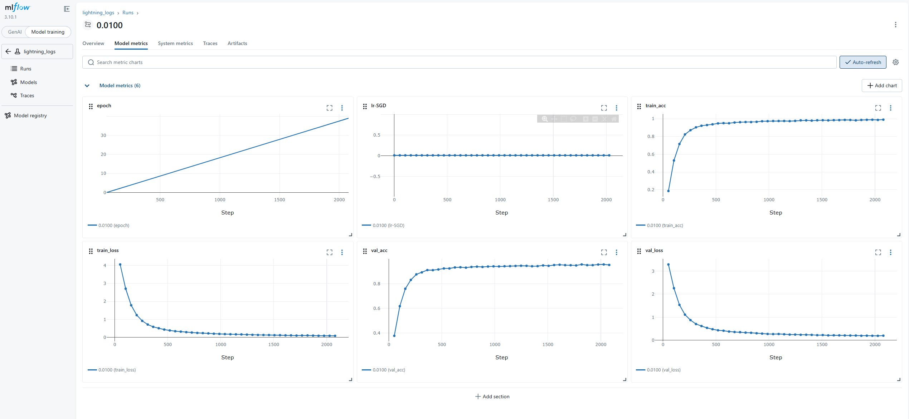

# Stage 3.2 — MLflow
This subfolder builds a complete training and experiment‑tracking pipeline for the Oxford 102 Flowers dataset using PyTorch Lightning and MLflow..

## File Structure
```
📁 02_mlflow/
├── 📁 preprocess/  # dataset access and split utilities
├── 📁 logs/  # checkpoints
├── 📁 profiler_output/  # Lightning profiler outputs and trace files
├── MLflow_flower.py  # DataModule, LightningModule, Trainer setup
├── mlflow.db
├── mlflow.png
└── README.md 
```

## Results
**Code:** 'MLflow_flower.py'  
**Artifact:** './logs', './profiler_output', 'mlflow.db', 'mlflow.png'
| Metric | Value |
|--------|-------|
| Dataset | Oxford 102 Flowers |
| Top-1 Accuracy | 95.3% (best:95.68%) |
| Epochs | 40 |
| Optimizer | SGD, lr=0.01, momentum =0.9, weight_decay=1e-4, |

  


## Key Finding  
PyTorch Lightning is integrated with MLflow to automatically log hyperparameters, losses, accuracies, and learning rate schedules, while saving the best model checkpoints under `./logs/checkpoints` to support experiment reproducibility and model comparison.  
Profiler outputs are stored in `./profiler_output`, enabling analysis of data‑loading and forward/backward pass bottlenecks for further optimization of training efficiency.
