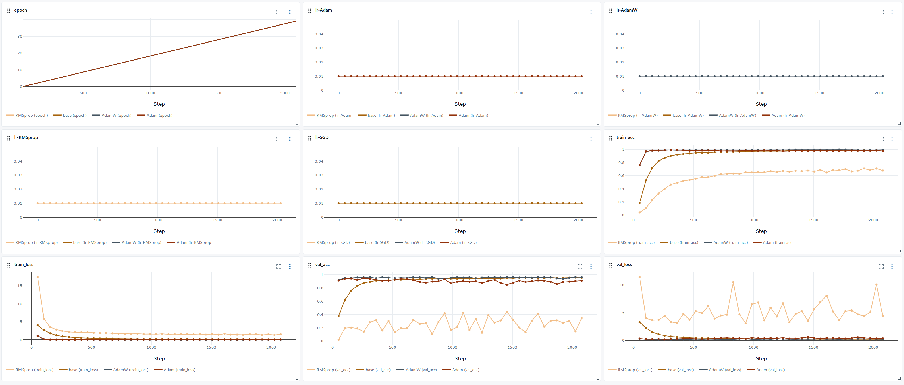

# Stage 3.3 — Hyperparameters

## File Structure
```
📁 03_hyperparameters/
├── 📁 preprocess/  # dataset access and split utilities
├── 📁 logs/  # checkpoints
├── 📁 profiler_output/  # Lightning profiler outputs and trace files
├── 📁 yaml_lr/ # cli yaml files for different lr running
├── 📁 yaml_optimizer/ # cli yaml files for different optimizers running
├── hyperparameters_flower.py  # DataModule, LightningModule, lightningCLI setup
├── mlflow.db
├── lr.png
├── optimizer.png
├── run_config.py # helper scripts to run multiple YAML config
└── README.md 
```

## Results
**Code:** 'hyperparameters_flower.py'  and corresponding yaml files
**Artifact:** './logs', './profiler_output', 'mlflow.db', 'lr.png', 'optimizer.png'
### Different lr 
| Run name     | lr     | Final val acc | Final val loss | Notes                 |
|-------------|--------|--------------:|---------------:|-----------------------|
| 1e-4  | 1e-4   | 0.2769          | 3.96           | Very slow learning    |
| 1e-3  | 1e-3   | 0.8461        | 1.04           | still learning after 40 ep |
| 1e-2  | 1e-2   | 0.9568          | 0.19           | arrive 90% at 10th epoch        |
| 1e-1  | 1e-1   | 0.9739        | 0.11           | fast learning       |

  

### Different optimizers

### Different optimizers

| Run name | lr   | Optimizer | Final val acc | Final val loss | Notes                                      |
|---------|------|-----------|--------------:|---------------:|--------------------------------------------|
| AdamW   | 1e-2 | AdamW     | 0.9650        | 0.20           | Fast, stable convergence, slightly best acc |
| Adam    | 1e-2 | Adam      | 0.9471        | 0.25           | Converges quickly, final acc slightly lower |
| base    | 1e-2 | SGD       | 0.9568        | 0.20           | Strong, stable baseline with simple SGD     |
| RMSprop | 1e-2 | RMSprop   | 0.4414        | 5.42           | numerically unstable and poor final acc  |

  

## Key Finding  
