# Stage 3.4 — Interpretability

This stage focuses on understanding and visualizing what the CNN model learns through various interpretability techniques.

## File Structure
```
📁 04_interpretability/
├── 📁 preprocess/          # Dataset utilities
├── 📁 outputs/             # Generated visualizations and analysis results
├── base.yaml               # Base YAML configuration
├── checkpoint_base_epoch=34_val_acc=0.9568.ckpt  # Trained model checkpoint
├── hyperparameters_flower.py  # Model and data module definitions
├── run_code.py             # Main entry point for running interpretability analysis
│
├── # Interpretability Scripts
├── gradcam_flower.py           # Grad-CAM visualization for correct predictions
├── gradcam_flower_true.py      # Grad-CAM for specific true class predictions
├── saliency_flower.py          # Saliency map visualization
├── saliency_flower_true.py     # Saliency maps for specific true class
├── error_analysis_lightning.py    # Analysis of misclassified samples
├── select_right_prediction.py  # Tools to select correctly classified samples
├── select_wrong_prediction.py  # Tools to select misclassified samples
```

## Code
`run_code.py`: the bash of running those following codes  
`hyperparameters_flower.py`: lightning data and model module with hyperparameters defined in `base.yaml`to produce `checkpoint_base_epoch=34_val_acc=0.9568.ckpt`

| Script | Technique | Purpose |
|--------|-----------|---------|
| `gradcam_flower*.py` | Grad-CAM | Visualize important regions in input images for CNN predictions |
| `saliency_flower*.py` | Saliency Maps | Show pixel-level importance based on gradient |
| `error_analysis_lightning.py` | Error Analysis | Evaluate the checkpoint on the 410-image test set, show the inference statistics |
| `select_right_prediction.py` | Sample Selection | Filter correctly classified samples for CAM and Saliency map |
| `select_wrong_prediction.py` | Sample Selection | Filter misclassified samples for CAM and Saliency map |

## Artifact
The artifacts are inside folder `./outputs`
| Name |  Purpose |
|--------|---------|
| `all_predictions.csv` | the results for all 410 test cases |
| `condusion_matrix.png` | plot to show confusion matrix of all 410 test cases |
| `per_class_accuracy.csv` | inference accuracy for every class, from worst to best |
| `summary.txt` | accuracy, f1 scores, precision recall calculations and statistics are here |
| `wrong_predictions.csv` |  misclassified samples |
| `gradcam_targets.csv` | filter 4 types of misclassified samples for CAM and Saliency map  |
| `gradcam_targets_true.csv` | filter 4 types of correctly classified samples for CAM and Saliency map |
| `gradcam_images` | CAM results |
| `saliency_images` | Saliency map |


## Results
### Statistics
The best checkpoint (`checkpoint_base_epoch=34_val_acc=0.9568.ckpt`) from **Stage3.3** is evaluated on the test set of 410 images:

- Overall test accuracy: **94.39%** (23 / 410 wrong predictions)
- Macro precision / recall / F1: **0.929 / 0.928 / 0.922**
- Weighted precision / recall / F1: **0.949 / 0.944 / 0.942**

The 10 worst classes by test accuracy are:
- `spring crocus`: 0.000 (0/1)
- `bolero deep blue`: 0.000 (0/1)
- `desert-rose`: 0.500 (1/2)
- `mallow`: 0.500 (1/2)
- `hibiscus`: 0.667 (4/6)
- `peruvian lily`: 0.667 (2/3)
- `sweet pea`: 0.667 (4/6)
- `trumpet creeper`: 0.667 (2/3)
- `gaura`: 0.667 (2/3)
- `siam tulip`: 0.667 (2/3)

Many of these classes have only 1–3 test samples, so a single mistake heavily affects their accuracy.

Typical confusion pairs (true → predicted, count) include:
- `sweet pea` → `toad lily`: 1
- `lenten rose` → `camellia`: 1
- `mexican petunia` → `pelargonium`: 1
- `carnation` → `sweet william`: 1
- `gaura` → `hibiscus`: 1
- `windflower` → `giant white arum lily`: 1
- `peruvian lily` → `passion flower`: 1
- `lotus` → `cyclamen`: 1
- `hibiscus` → `cape flower`: 1
- `bolero deep blue` → `sweet pea`: 1

Most confusions occur between visually similar species (e.g. `mexican petunia` vs `pelargonium`, `sweet pea` vs `toad lily`), which motivates the interpretability analysis in this folder (Grad-CAM and saliency maps on both correct and misclassified samples).

### CAM and saliency examples

We visualize both Grad-CAM and saliency maps on four flower classes:
`mexican petunia`, `windflower`, `sweet pea`, and `hibiscus`.  
For each class, we compare at least one misclassified sample with one correctly classified sample at high confidence.

**mexican petunia**  
  - Wrong: sample **ID 31**, true `mexican petunia` but predicted `pelargonium` with confidence **0.856**.  
  - Correct: sample **ID 98**, true `mexican petunia`, predicted `mexican petunia` with confidence **0.987**.  

<figure>
  <figcaption>CAM – misclassified (ID 31, conf 0.856)</figcaption>
  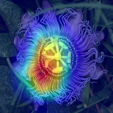
</figure>

<figure>
  <figcaption>CAM – correctly classified (ID 98, conf 0.987)</figcaption>
  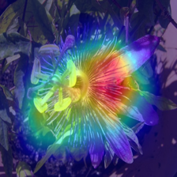
</figure>

<figure>
  <figcaption>Saliency – misclassified (ID 31, conf 0.856)</figcaption>
  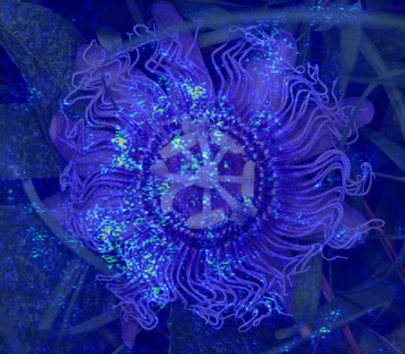
</figure>

<figure>
  <figcaption>Saliency – correctly classified (ID 98, conf 0.987)</figcaption>
  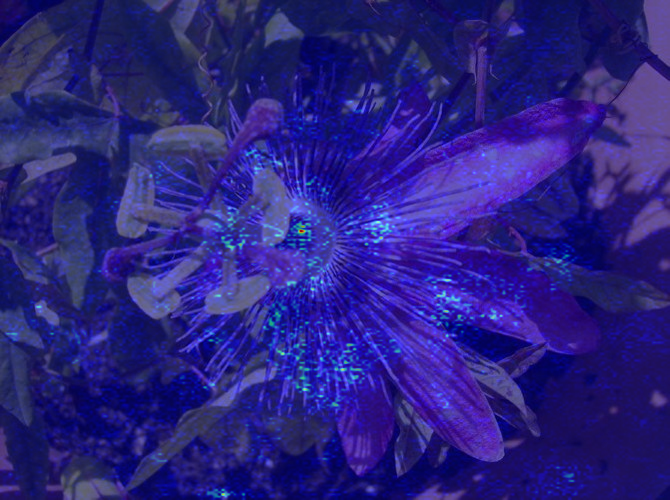
</figure>

For the mexican petunia class, Grad-CAM highlights different parts of the flower for the correct and misclassified samples.

- In the correctly classified sample, Grad-CAM focuses on both the central disk of the flower and the surrounding petals, and the saliency map shows strong responses along the petal edges and the intricate structures near the center.
- In the misclassified sample, the model still concentrates on the flower region, but Grad-CAM and saliency shift more onto the petal shapes and textures, with less emphasis on the central structure.

**windflower**  
  - Wrong: sample **ID 87**, true `windflower` but predicted `giant white arum lily` with confidence **0.650**.  
  - Correct: sample **ID 277**, true `windflower`, predicted `windflower` with confidence **0.998**.  

<figure>
  <figcaption>CAM – misclassified (ID 87, conf 0.650)</figcaption>
  
</figure>

<figure>
  <figcaption>CAM – correctly classified (ID 277, conf 0.998)</figcaption>
  
</figure>

<figure>
  <figcaption>Saliency – misclassified (ID 87, conf 0.650)</figcaption>
  
</figure>

<figure>
  <figcaption>Saliency – correctly classified (ID 277, conf 0.998)</figcaption>
  
</figure>

For the wind flower class, Grad-CAM and saliency map highlight different parts of the flower for the correct and misclassified samples.

- In the correctly classified sample, Grad-CAM focuses on both the central disk of the flower, the surrounding petals and leaf, and the saliency map shows strong responses along the petal edges, the intricate structures near the center and leaf.
- In the misclassified sample, the model still concentrates on the flower region, but Grad-CAM and saliency shift more onto the petal shapes and textures, with less emphasis on the central structure.
- The saliency maps show clear difference among misclassified and correctly classified examples.

**sweet pea**  
  - Wrong: sample **ID 14**, true `sweet pea` but predicted `toad lily` with confidence **0.517**.  
  - Correct: sample **ID 22**, true `sweet pea`, predicted `sweet pea` with confidence **0.985**.  

<figure>
  <figcaption>CAM – misclassified (ID 14, conf 0.517)</figcaption>
  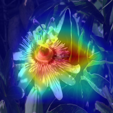
</figure>

<figure>
  <figcaption>CAM – correctly classified (ID 22, conf 0.985)</figcaption>
  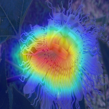
</figure>

<figure>
  <figcaption>Saliency – misclassified (ID 14 conf 0.517)</figcaption>
  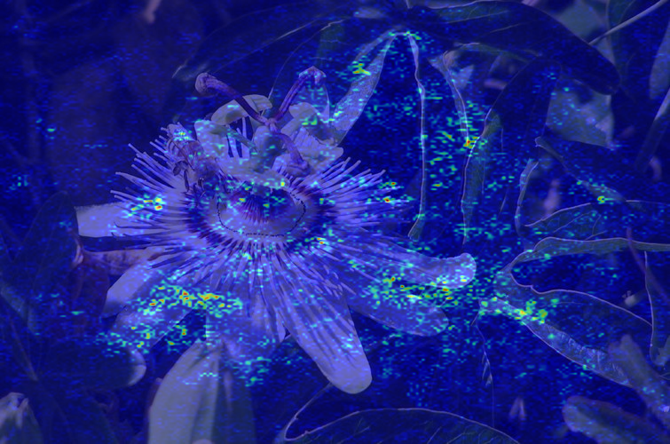
</figure>

<figure>
  <figcaption>Saliency – correctly classified (ID 22, conf 0.985)</figcaption>
  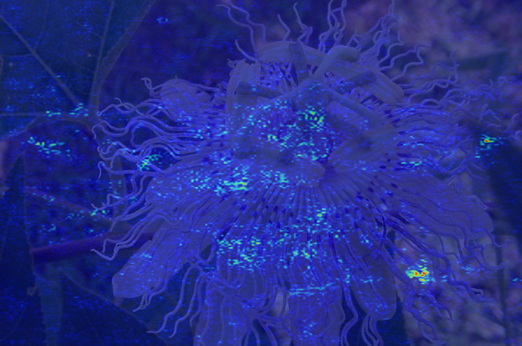
</figure>  
For the sweet pea class, the misclassified sample shows Grad-CAM and saliency spreading more onto the surrounding leaves and background, while the correctly classified sample keeps most of the attention on the flower cluster itself.  

**hibiscus**  
  - Wrong: sample **ID 124**, true `hibiscus` but predicted `cape flower` with confidence **0.217**.  
  - Correct: sample **ID 229**, true `hibiscus`, predicted `hibiscus` with confidence **0.994**.  

<figure>
  <figcaption>CAM – misclassified (ID 124, conf 0.217)</figcaption>
  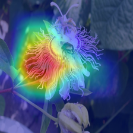
</figure>

<figure>
  <figcaption>CAM – correctly classified (ID 229, conf 0.994)</figcaption>
  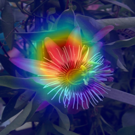
</figure>

<figure>
  <figcaption>Saliency – misclassified (ID 124, conf 0.217)</figcaption>
  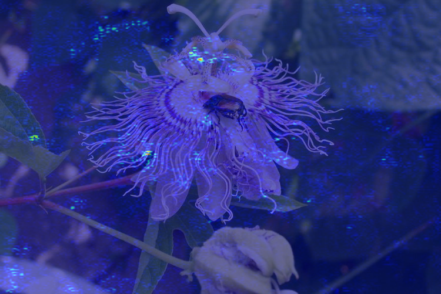
</figure>

<figure>
  <figcaption>Saliency – correctly classified (ID 229, conf 0.994)</figcaption>
  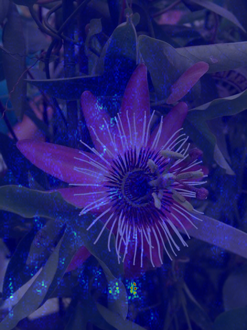
</figure>

In the misclassified sample , the attention is still roughly on the flower, but Grad-CAM spreads more diffusely across the petals and nearby structures, and the saliency map shows noisier responses.

## Key Findings
- **Learning rate** is critical: lr=1e-2 reaches ~0.9 validation accuracy by epoch 10 and stabilizes around 0.96
- With lr=1e-2, SGD, Adam, and AdamW all achieve similar final accuracy (~0.95–0.97); AdamW is slightly best
- **Default configuration**: SGD (lr=1e-2, momentum=0.9, weight_decay=1e-4) — simple, stable, competitive
- Using **LightningCLI + YAML configs**, experiments are defined declaratively with MLflow logging

