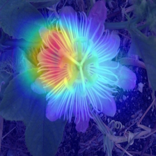
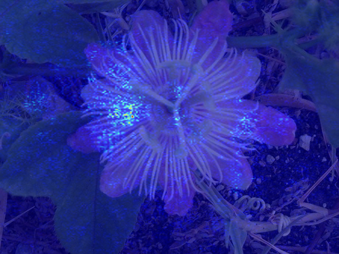
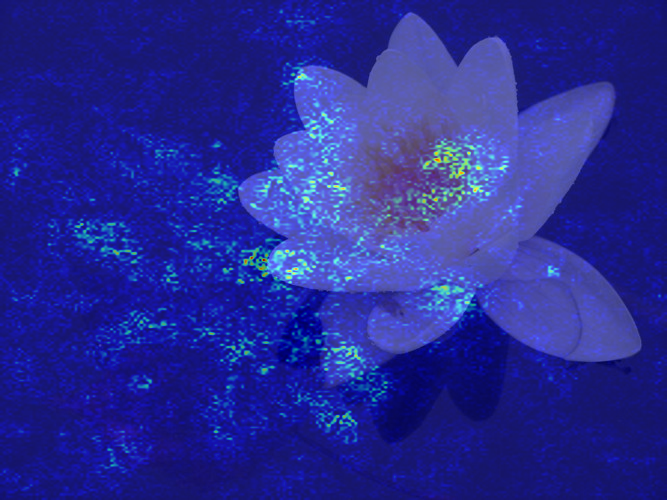

# Stage 3 — Experiment Management

## Goal

Stage 1&2 established a strong CNN and transfer learning pipeline on the Oxford 102 Flowers dataset, with the best EfficientNet-B0 fine-tuning result reaching 97.31% top-1 accuracy.

But the training process itself was messy: no unified way to log hyperparameters and metrics, no visibility into GPU/CPU utilization, which parts delaying training, and comparing runs required manually checking saved
files one by one, how I can interpret the prediction results, etc.. These problems slow down iteration. As the Chinese saying goes: `工欲善其事，必先利其器` (if a craftsman wants to do good work,  he must first sharpen his tools). 
Fortunately，the ML community has developed dedicated tooling to address exactly this class of workflow issues.

This stage introduces experiment management: setting up proper tooling to organize training code, track and compare runs, then using this workflow to study how key hyperparameters affect accuracy. Last, use CAM and saliency map to interpret model behavior.

## What This Stage Covers
- Lighting module: Refactor EfficientNet-B0 training into `LightningDataModule` + `LightningModule`, replacing the hand-written training loop with Trainer-managed epochs, built-in LR logging, and `ModelCheckpoint` callbacks
- MLFlow: Every training run automatically logs hyperparameters, per-epoch metrics, epoch time, and model artifacts; compare runs visually via `mlflow ui`.
- Hyperparameters: Use the `LightningCLI` + `MLflow` workflow to systematically compare learning rates, optimizers; produce a clean results table.
- Interpretability: Analyze error to show more prediction details, use saliency maps and CAM/Grad-CAM to visualize which regions drive predictions.

## File Structure
```
📁 03_experiment_management/
├── 📁 01_lightning_module/ # Single-run baseline with Lightning (data module, model, trainer, callbacks)
│   ├── 📁 preprocess/  
│   ├── 📁 logs/ 
│   ├── 📁 profiler_output/  
│   ├── lightning_flower.py
│   └── README.md
│
├── 📁 02_mlflow/  # MLflow experiment tracking for a single run
│   ├── 📁 preprocess/  
│   ├── 📁 logs/  
│   ├── 📁 profiler_output/  
│   ├── MLflow_flower.py
│   ├── mlflow.db
│   ├── mlflow.png
│   └── README.md
│
├── 📁 03_hyperparameters/ # Hyperparameter search (LR / optimizer) with LightningCLI + MLflow
│   ├── 📁 preprocess/  
│   ├── 📁 logs/  
│   ├── 📁 profiler_output/ 
│   ├── 📁 yaml_lr/
│   ├── 📁 yaml_optimizer/
│   ├── hyperparameters_flower.py 
│   ├── mlflow.db
│   ├── lr.png
│   ├── optimizer.png
│   ├── run_config.py
│   └── README.md
│
├── 📁 04_interpretability/ # Error analysis, Grad-CAM, and saliency for model interpretation
│   ├── 📁 preprocess/          
│   ├── 📁 outputs/            
│   ├── base.yaml               
│   ├── checkpoint_base_epoch=34_val_acc=0.9568.ckpt 
│   ├── hyperparameters_flower.py
│   ├── run_code.py          
│   ├── # Interpretability Scripts
│   ├── gradcam_flower.py         
│   ├── gradcam_flower_true.py    
│   ├── saliency_flower.py        
│   ├── saliency_flower_true.py    
│   ├── error_analysis_lightning.py
│   ├── select_right_prediction.py 
│   ├── select_wrong_prediction.py
│
└── README.md 
```

## Key Design Decisions

**1. Why PyTorch Lightning**

The Stage 2 training loop (`model/training_loop.py`) was reasonably clean, but it still required manually handling the epoch loop, metric accumulation, best‑model tracking, device placement, and learning‑rate scheduling. 
PyTorch Lightning handles all of this via `Trainer`, so the module code only needs to define *what* happens (forward pass, loss, optimizer) rather than *how* the training loop is executed.

In this stage, several built‑in and custom callbacks are also deployed:

- `LearningRateMonitor`: logs the learning rate each epoch automatically, with no manual tracking code.
- `ModelCheckpoint`: saves the best and/or last checkpoints based on `val_acc` without any custom save logic.
- `ProgressiveBackboneFinetuning`: encodes the gradual unfreezing strategy as a reusable callback, instead of hard‑coding it into the training loop.
- `PostFreezeModelSummary`: prints the total and trainable parameter counts whenever the finetuning state changes.
- `MLFlowLogger` (in folder `02_mlflow`): plugs directly into `Trainer` so that hyperparameters, metrics, and artifacts are logged to MLflow with minimal extra code.

Other useful tools:

- `Profiler`: records detailed timing and memory information during training to help identify performance bottlenecks.

**2. Why MLflow**

Stage 2 produced six nearly identical scripts to track six experimental configurations. MLflow
solves this by treating each training run as a named artifact with full parameter + metric history.
Key capabilities used:

- `mlflow ui`: browser-based dashboard to compare runs side by side
- Artifact logging: best checkpoint `.pth` stored alongside its run, always traceable
- No external server needed: local SQLite backend (`mlflow.db`) sufficient for solo projects

**3. Experiment Design: Change One Variable at a Time**

At this stage I use LightningCLI to speed up running multiple experiments. Each experiment group changes **only one** variable (for example, learning rate or optimizer), while keeping all other settings fixed. 
This makes it easy to compare runs and see the isolated effect of that single change.

**4. Interpretability: use tools to understand model behavior instead of relying only on accuracy**
- Confusion matrix, per-class accuracy, and a few failure examples to see which flower classes are hardest and how the model makes mistakes.
- Saliency and (Grad-)CAM heatmaps to show which image regions drive each prediction.

---  
## Hyperparameter Experiment Plan

### Group 1 — Learning Rate
Fixed: `optimizer=SGD`, `batch_size=128`, `epochs = 40`

| LR | Val Acc (%) | Best Epoch | Notes |
|----|-------------|------------|-------|
| 1e-4| 0.2769     | 40    | Very slow learning    |
| 1e-3| 0.8461     | 40    | slow learning and still underfits after 40 epochs |
| 1e-2| 0.9568     | 34    | Fast, stable convergence; reaches ~0.9 validation acc by epoch 10        |
| 1e-1| 0.9739     | 35    | fast learning, better validation acc       |

### Group 2 — Optimizer
Fixed: `lr=1e-2`, `batch_size=64`, `epochs = 40` 

| Optimizer | Val Acc (%) | Best Epoch | Notes |
|-----------|-------------|------------|-------|
| AdamW     | 0.9650      | 38         | Fast, stable convergence, slightly best acc |
| Adam      | 0.9471      | 04         | Converges quickly, final acc slightly lower |
| SGD       | 0.9568      | 34         | Strong, stable baseline with simple SGD     |
| RMSprop   | 0.4414      | 27         | numerically unstable and poor final acc  |

*All information are summarized in `03_hyperparameters/README.md`.*

---

## Results

| Group      | Best config | Val acc (%) | Key finding                                           |
|-----------|-------------|-------------|-------------------------------------------------------|
| LR sweep  | 1e-1        | 97.39       | A relatively large learning rate works best for the newly added classifier head. |
| Optimizer | AdamW       | 96.50       | The choice of optimizer has a noticeable impact on convergence and final accuracy. |

---

## (Grad-)CAM and Saliency heatmap  
**windflower**  
  - Wrong: sample **ID 87**, true `windflower` but predicted `giant white arum lily` with confidence **0.650**.  
  - Correct: sample **ID 277**, true `windflower`, predicted `windflower` with confidence **0.998**.  

<figure>
  <figcaption>CAM – misclassified (ID 87, conf 0.650)</figcaption>
  
</figure>

<figure>
  <figcaption>CAM – correctly classified (ID 277, conf 0.998)</figcaption>
  
</figure>

<figure>
  <figcaption>Saliency – misclassified (ID 87, conf 0.650)</figcaption>
  
</figure>

<figure>
  <figcaption>Saliency – correctly classified (ID 277, conf 0.998)</figcaption>
  
</figure>

For the windflower class, Grad-CAM and saliency map highlight different parts of the flower for the correct and misclassified samples.

- In the correctly classified sample, Grad-CAM focuses on both the central disk of the flower, the surrounding petals and leaf, and the saliency map shows strong responses along the petal edges, the intricate structures near the center and leaf.
- In the misclassified sample, the model still concentrates on the flower region, but Grad-CAM and saliency shift more onto the petal shapes and textures, with less emphasis on the central structure.
- The saliency maps show clear difference among misclassified and correctly classified examples.  

*All information are summarized in `04_interpretability/README.md`.*

## Key Findings

- A structured experiment-management setup (PyTorch Lightning + MLflow + LightningCLI) makes it much easier to run, reproduce, and compare many CNN experiments than hand-written training loops and ad‑hoc scripts. It turns hyperparameter tuning into a traceable, data-driven process rather than guesswork.

- On Oxford 102 Flowers, a relatively large learning rate for the new classifier head (1e‑1 with SGD) achieves the best validation accuracy (97.39%), and the choice of optimizer (AdamW vs SGD vs Adam vs RMSprop) has a clear impact on convergence speed and final performance.

- Detailed error analysis (per-class accuracy, confusion matrix, `wrong_predictions.csv`) shows that most remaining errors come from very small or visually similar classes, rather than from a fundamentally flawed model, which explains the gap between macro and weighted metrics.

- Grad-CAM and saliency maps confirm that the model mostly focuses on meaningful flower structures (petals, center, filaments) instead of background artifacts; when it fails, the attention patterns reveal whether the model is confused by similar petal textures or distracted by leaves and background.

- The interpretability results directly suggest next steps: improve data balance for tail classes, strengthen background-robust augmentations, and consider fine-grained methods (e.g. better backbones or metric-learning losses) to separate species with very similar petal shapes and textures.

## Questions / Open Points

- How far can performance be improved on the hardest, low-sample classes by only adjusting data-related factors (class-balanced sampling, targeted augmentation, mixup / CutMix), before changing the backbone architecture?

- Would a slightly larger backbone (e.g. EfficientNet-B1/B2) or a fine-grained loss (center loss, ArcFace, contrastive loss) give a meaningful boost on confusing pairs such as `mexican petunia → pelargonium` and `sweet pea → toad lily`?

- Can we design augmentations that specifically reduce the model’s reliance on leaves and background (as seen in some sweet pea failures) without hurting overall accuracy on the easier classes?

- How well does this experiment-management and interpretability workflow generalize to other datasets (e.g. non-flower natural images or industrial inspection data), and what needs to change to reuse it quickly in a new project?
---

## References

- Falcon et al., [PyTorch Lightning](https://lightning.ai/docs/pytorch/stable/), Lightning AI, 2019.
- Zaharia et al., [MLflow: A Machine Learning Lifecycle Platform](https://mlflow.org), Databricks, 2018.
- Selvaraju et al., [Grad-CAM: Visual Explanations from Deep Networks](https://arxiv.org/abs/1610.02391), ICCV 2017.
- Kolesnikov et al., [Big Transfer (BiT): General Visual Representation Learning](https://arxiv.org/abs/1912.11370), ECCV 2020.
