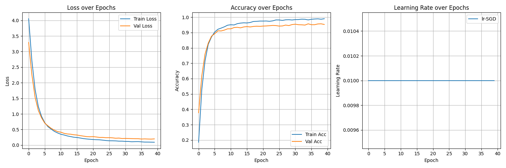

# Stage 3.1 — Lightning Module
This subfolder refactors the EfficientNet‑B0 fine‑tuning pipeline from a hand‑written training loop (Stage 2) into a PyTorch Lightning setup. It keeps the same model architecture and dataset（only training classifier head）, 
but moves all training orchestration (epochs, device placement, checkpointing, LR logging, profiling) into `Trainer` and callbacks.

## File Structure
```
📁 01_Lightning_module/
├── 📁 preprocess/ 
├── 📁 logs/
├── 📁 profiler_output/
├── 📁 profiler_output/
├── lightning_flower.py
└── README.md 
```

## Results
**Code:** lightning_flower.py  
**Artifact:**  
| Metric | Value |
|--------|-------|
| Dataset | Oxford 102 Flowers |
| Top-1 Accuracy | 95.28% (best:95.68%) |
| Epochs | 40 |
| Optimizer | SGD, lr=0.01, momentum =0.9, weight_decay=1e-4, |

  

## Key Finding
